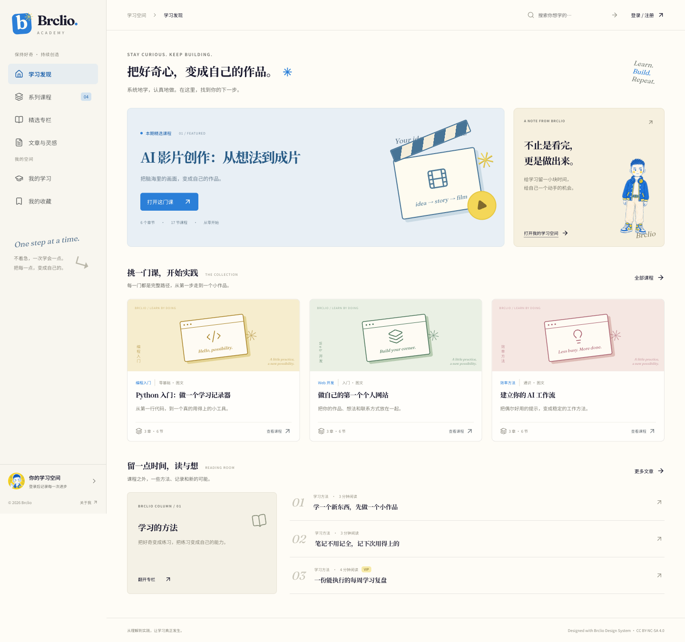

# Brclio Academy

从理解到实践，让学习真正发生。基于 Next.js 的系列课程、文章与专栏平台，遵循 Brclio Design System。

所有人可以注册，验证邮箱后使用密码登录；管理员为指定账号设置 VIP 截止时间，服务端在每次受保护请求时检查权限。支持 YouTube 多视频课时、章节顺序、继续学习、完成记录、课程收藏与个人笔记。



## 本地启动

需要 Node.js 24 LTS 和 npm。SQLite 使用 Node 内置的 `node:sqlite`，无需单独安装数据库服务。

```bash
npm ci
cp .env.example .env.local
npm run dev
```

打开 [本地网站](http://localhost:3000)。默认使用 `.data/academy.sqlite`。开发邮件写入 `.data/dev-mail.jsonl`，注册页面输入文件中对应邮箱的六位验证码即可；这是本地验证通道，不会发送真实邮件。生产环境必须选择 SMTP 或 Resend。

创建首个管理员（在另一个终端执行，邮箱替换成自己的）：

```bash
read -s ADMIN_PASSWORD
export ADMIN_PASSWORD
npm run admin -- --email owner@example.com --name Brclio
unset ADMIN_PASSWORD
```

密码至少 10 位。管理员初始化是运维操作，直接建立已验证的管理员身份；正式学员仍须完成邮箱验证。使用这个账号登录后打开后台。管理员学习课程也需要有效 VIP，可在后台为自己设置到期时间。

## 内容与功能

| 内容 | 初始化数据 |
| --- | --- |
| AI 影片创作 | 提供的 19 段视频，6 章、17 节，前两节各有两段视频 |
| Python 入门 | 3 章、6 节图文课，完成学习记录器 |
| 个人网站 | 3 章、6 节图文课，包含代码与验收任务 |
| AI 工作流 | 3 章、6 节图文课，包含模板与练习 |
| 专栏与文章 | 2 个专栏、6 篇文章，支持公开与 VIP 正文 |

四门课程均标记为示例。AI 课程的配套练习根据章节标题编写，不是视频转录；其余课程是可跟做的图文示例，没有填充虚构视频或课时时长。新库首次创建时加载示例，已有数据库不会被代码中的示例更新覆盖。后台可以添加、修改、排序、发布或下架内容。

## 部署与维护

- [完整部署教程](docs/DEPLOYMENT.md)：Vercel + 私有 GitHub 加密数据、服务器 SQLite、Docker、Nginx、备份恢复。
- [后台操作与内容格式](docs/ADMIN.md)：VIP 有效期、课程章节、课时多视频、文章、专栏与示例 JSON。
- [架构与运行边界](docs/ARCHITECTURE.md)：认证、权限、数据适配器、GitHub 写入限制与迁移条件。
- [验证与交付检查](docs/QA.md)：内容完整性、客户端包检查、生产启动与浏览器验收。
- [示例视频核验](docs/VIDEO-CHECK.md)：全部 19 个链接的元数据检查结果。
- [设计来源](docs/design/README.md)：品牌规范、原始 App 模板与资源署名。

| 场景 | 推荐配置 |
| --- | --- |
| 本机体验、单台持久化服务器 | `DATA_DRIVER=sqlite` |
| Vercel、小规模低频写入 | `DATA_DRIVER=github`，数据仓库必须私有 |
| GitHub Pages | 只适合静态文件，不能运行本项目的认证与权限后端 |

YouTube 请使用 **Unlisted / 不公开** 且允许嵌入的视频。Private / 私享需要 YouTube 侧逐人授权，网站 VIP 不能替代。Unlisted 链接一旦被有权限者取得，仍可能被转发；本平台控制网站内的学习入口，不提供视频 DRM。[YouTube 官方说明](https://support.google.com/youtube/answer/157177?hl=zh-Hans)

## 验证命令

```bash
npm run typecheck
npm test
npm run build
node scripts/audit-client.mjs
```

生产构建可使用 `npm start` 启动；脚本会准备 standalone 静态资源，并保留项目根目录的数据库路径。

真实邮件到达、19 段 YouTube 视频的账号权限与嵌入可用性、正式域名和远端部署需要在自己的服务配置下验收。仓库中的本地测试不能替代这些服务验收。

## 品牌与资源

设计基于 [Brclio Design System](https://github.com/Brclio/brclio-design-system)，© 2026 Brclio，CC BY-NC-SA 4.0。相应模板、设计与品牌资源的署名和协议保留在 [设计文档](docs/design/README.md)。示例视频链接来自项目需求，视频内容权利归其权利人。
